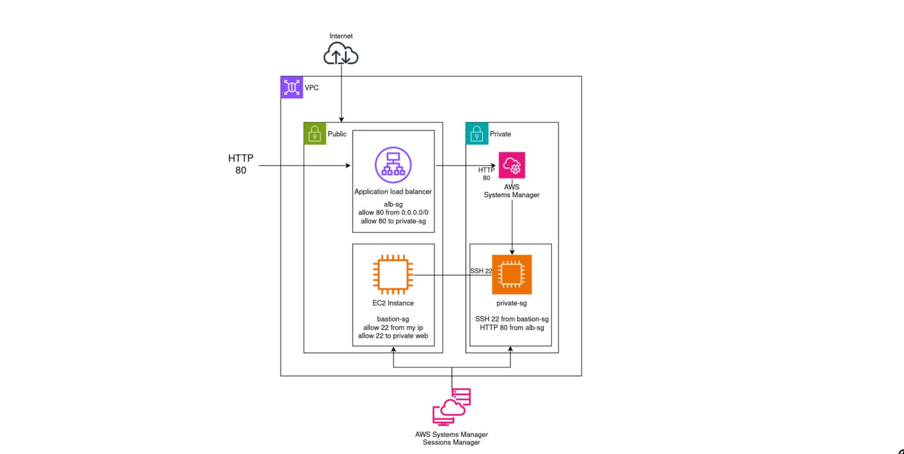
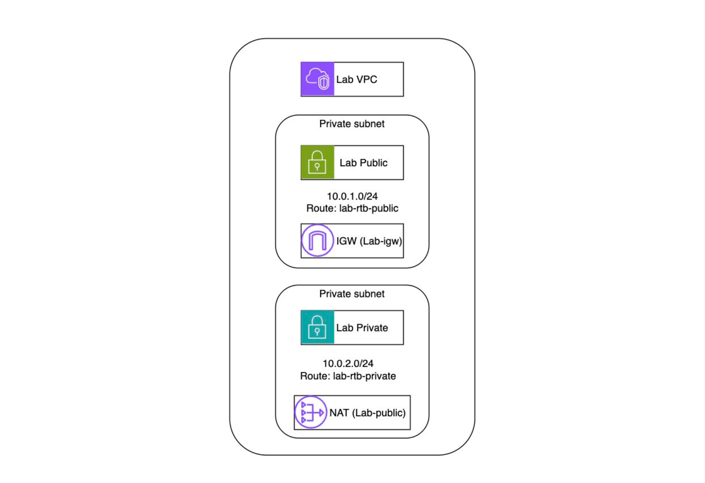
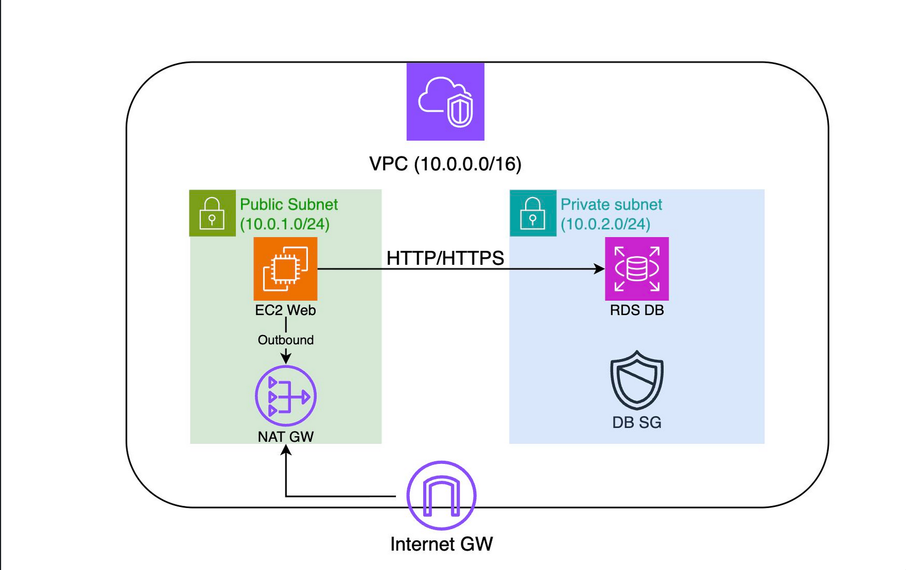
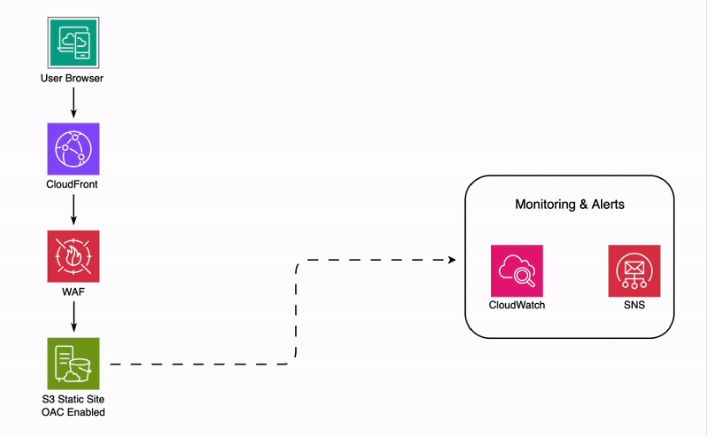
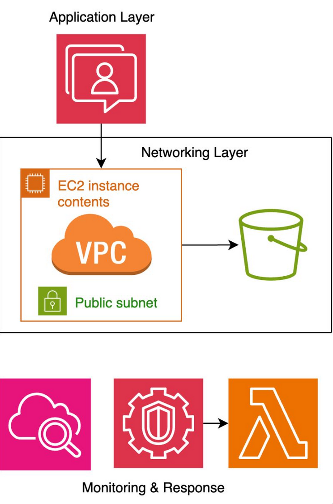
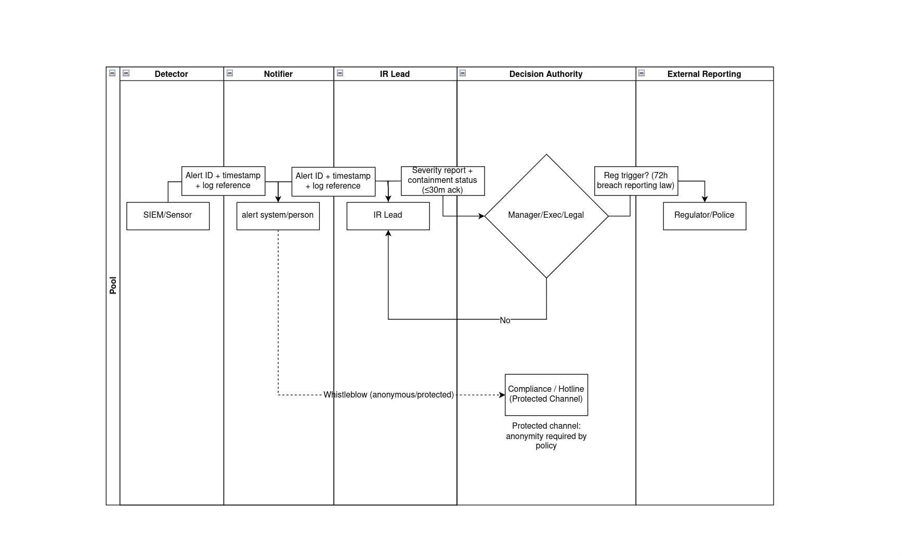

# Architecture diagrams

I put all diagrams here to keep the main README clean. Click any image to view full size.

## AWS diagrams

### Bastion to private instance network flow

### VPC public and private subnet layout

### Web to database traffic pattern

### Secure static website delivery and monitoring

### Application, networking, and monitoring layers overview

## Security+ diagrams

