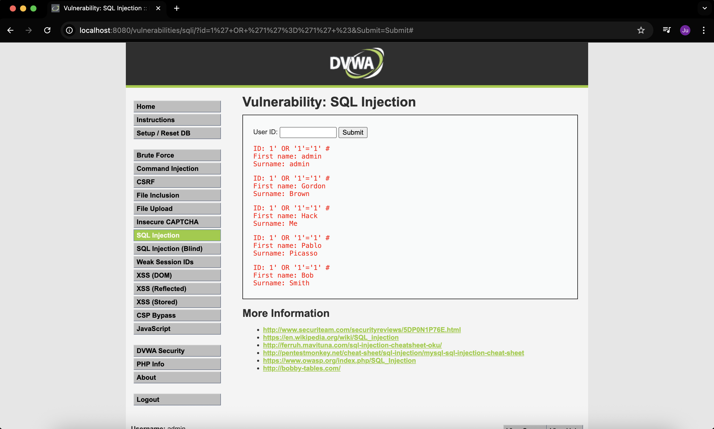
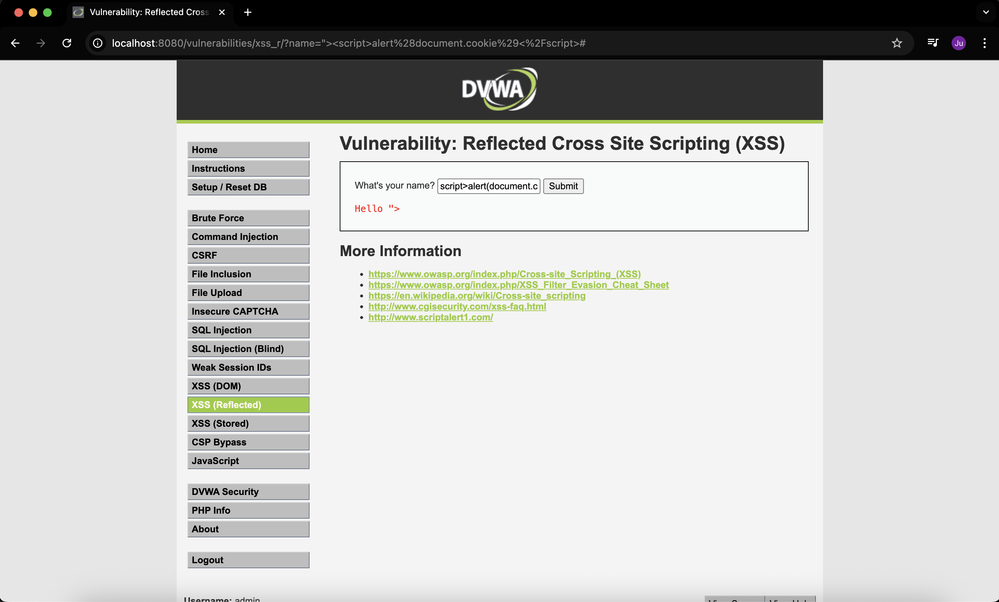

# Week 1 — DVWA Lab: SQLi & XSS

**What I did:**  
Ran a small DVWA lab to test two common web bugs — **SQL Injection (SQLi)** and **Reflected XSS**.  
I did this to try and understand how these attacks work and how they look in action. Notes, steps, and screenshots are all in this repo.

## Setup
1. Started DVWA using Docker.  
2. Went to `http://localhost:8080/` and logged in with `admin` / `password`.  
3. Clicked **Setup / Reset DB** and set the security level to **Low**.

---

## What I proved
- **SQLi:** I used a payload that made the site show user rows from the database, meaning it didn’t handle the input safely.  
  

---

- **Reflected XSS:** I injected a script that got sent back and ran in the browser. The site didn’t escape the input properly.  
  

---

## Files 
- [DVWA-checklist.md](DVWA-checklist.md) — setup steps and quick checks.  
- [sqli-steps.md](sqli-steps.md) — the SQLi payloads and what I tried.  
- [xss-steps.md](xss-steps.md) — notes on the XSS test.  
- [compression.md](compression.md) — short summary and how to fix it.  

## Short takeaway and the next step
Both bugs worked on **Low** security.  
Next I’ll try adding simple fixes — **parameterized queries** for SQLi and **output encoding** for XSS — then re-test to see if they’re patched.
