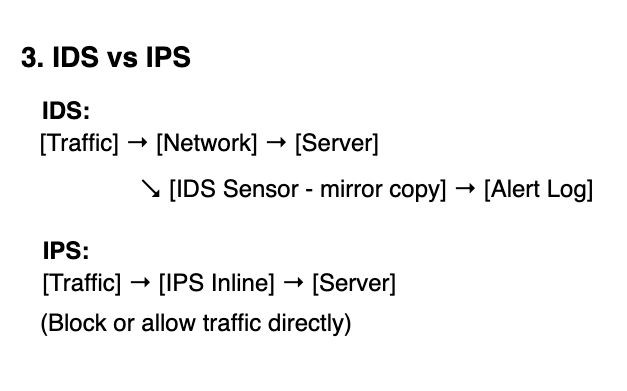

# IDS / IPS Notes (Security+)

- IDS = Intrusion Detection System → monitors traffic, detects suspicious activity.  
- IPS = Intrusion Prevention System → monitors traffic AND can block/stop it.

## Key Difference
- IDS = alert only (out-of-band, passive).  
- IPS = can drop/block (in-line, active).  
- Think: IDS = security camera; IPS = security guard who can step in.

## Types
- NIDS = Network-based IDS → sits on network, monitors traffic (like a tap/span port).  
- HIDS = Host-based IDS → runs on a single machine, watches logs + processes.

## Detection Methods
- Signature-based → matches known attack patterns (fast, but misses new/unknown).  
- Anomaly/Behavior-based → flags deviations from baseline (good for zero-day, but can cause false positives).

## Placement
- IDS usually off to the side (out-of-band) → can’t slow traffic.  
- IPS sits inline (between firewall + network) → can actively drop malicious packets.

## Strengths / Weaknesses
- IDS  
  + Good visibility/alerting.  
  – Can’t stop attack directly.  

- IPS  
  + Can block in real-time.  
  – Risk of false positives blocking legit traffic.  
  – Must be carefully tuned (trade-off: security vs availability).

## Analogies
- IDS = motion sensor → beeps if intruder detected.  
- IPS = guard dog → barks *and* bites intruder.

### Diagram

