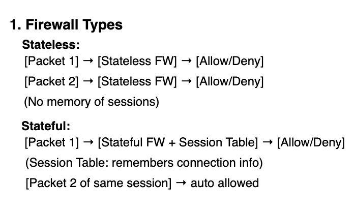
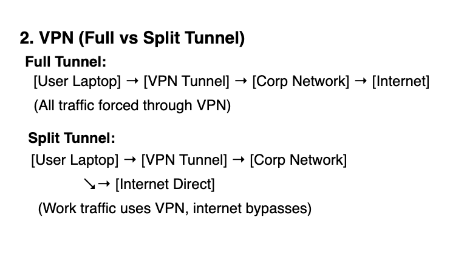

# Week 2 — Firewalls / VPN / IDS & IPS

## Learning Objectives
- Distinguish firewall types (stateless, stateful, WAF)  
- Compare full-tunnel vs split-tunnel VPN  
- Understand IDS vs IPS and appropriate deployment

## Diagrams
-   
-   
- 

## Artifacts / Notes
- [Firewalls & WAF notes](Firewalls.md)  
- [VPN notes](VPN.md)  
- [IDS / IPS notes](IDS_IPS.md)  
- [Firewall rules + VPN snippet](firewall_rules.md)

## Cross-links
- WAF examples in Firewalls.md  
- VPN config snippet in firewall_rules.md  
