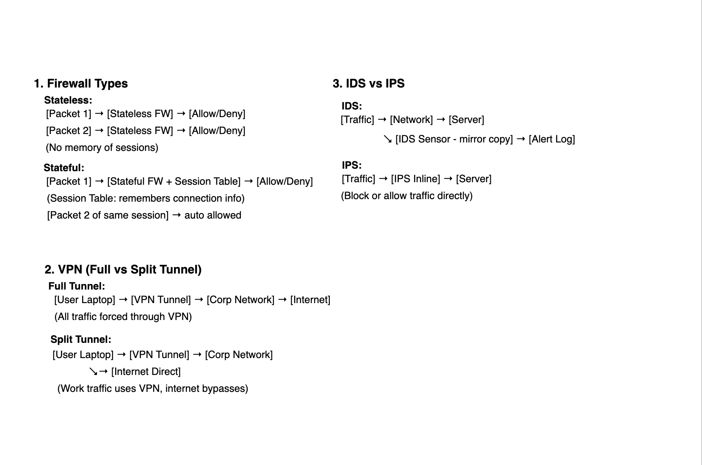

# VPN Notes (Security+)

- VPN = Virtual Private Network → encrypted tunnel across untrusted network (e.g., internet).  
- Protects confidentiality (hides traffic) + integrity (prevents tampering).

## Types
- Remote Access VPN → user connects from home/travel into corp network.  
- Site-to-Site VPN → whole networks connected securely (branch office ↔ HQ).

## Protocols
- IPSec
  - AH = integrity only (rare).
  - ESP = encryption + integrity (main one).
- SSL/TLS VPN → runs in browser, flexible for remote users.
- L2TP/IPSec → older, still around.
- IKEv2/IPSec → stable, used a lot on mobile.

## Full vs Split Tunnel
- Full Tunnel → all traffic forced through VPN (safer, but slower).
- Split Tunnel → only corp traffic uses VPN; internet direct (faster, but less secure).

## Auth
- MFA common (password + token/app).
- Can use digital certs to trust devices.

## Strengths / Weaknesses
- + Strong encryption, blocks sniffing.
- + Good for public Wi-Fi use.
- – Split tunnel can leak data.
- – VPN gateways = single points of failure.
- – Misconfigs = open doors.

## Analogies
- VPN tunnel = secret underground passage → people see cars enter/exit, but can’t look inside.
- Full vs Split = using the tunnel for everything (full) vs only work errands (split).

### Diagram

