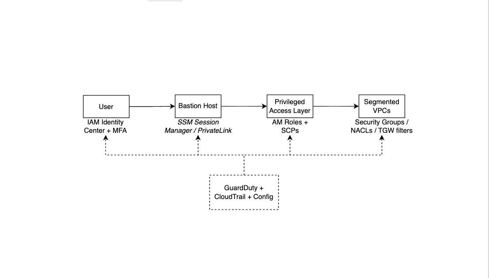

# Zero Trust Governance 

## Zero Trust Flow v1
User → Bastion Host → Privileged Access Layer → Segmented VPCs

---

## Control Mapping Table

| Checkpoint | AWS Service / Control | Purpose |
|-------------|----------------------|----------|
| User Authentication | IAM Identity Center / MFA | Verify identity and enforce conditional access |
| Bastion Isolation | EC2 Bastion / SSM Session Manager | Secure admin plane access, no direct inbound SSH |
| Privileged Access Layer | IAM Roles / SCPs | Enforce least privilege and continuous verification |
| Segmented VPCs | VPC, Subnets, Security Groups, NACLs | Contain blast radius and restrict lateral movement |
| Monitoring | GuardDuty / CloudTrail / Config | Detect and audit anomalous behavior across layers |

---

## Governance Integration Notes

- **Zero Trust Principle:** Every session re-validated; no implicit trust.  
- **Admin Plane Isolation:** Management VPC only reachable via bastion or SSM.  
- **Break-Glass Account:** Offline MFA-protected root for emergencies only.  
- **SBOM Assurance:** CodeBuild/Inspector generate dependency inventories.  
- **Secure-by-Design:** Infrastructure-as-Code templates enforce encryption & tagging.  
- **Segmentation Enforcement:** Prod, Dev, and Test VPCs separated via TGW route filters.

---
