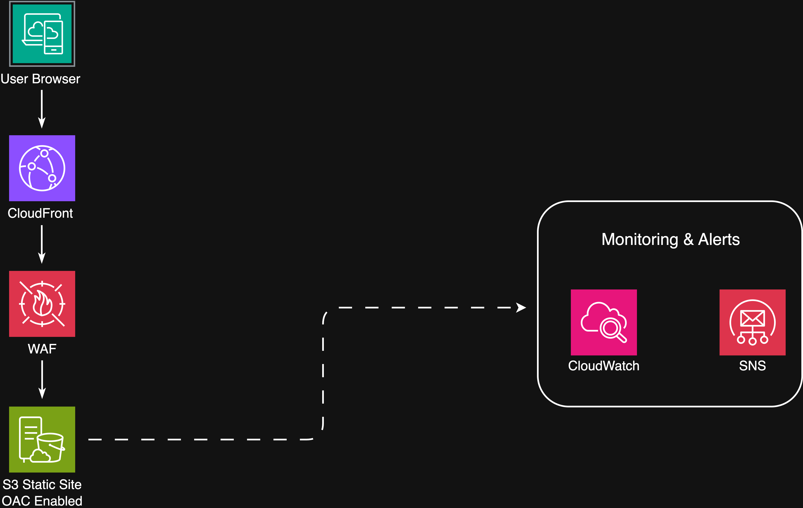

# Portfolio Site (AWS)

Static hosting on S3 with CloudFront.
- Architecture: S3 → CloudFront → (WAF optional) → User
- CloudWatch alarm configured
- Domain: using AWS-provided link (no custom domain yet)

**Reflection:** Early deployment complete / AWS humbled me (many errors fixed along the way).

